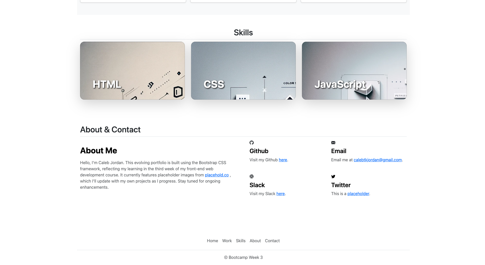

# Caleb Jordan's Portfolio Page - Bootstrap (Week 3)

## Overview
Welcome to the Week 3 update of my portfolio in the front-end web development course. This iteration showcases my growing skills, with a focus on building a Bootstrap-based portfolio.

## Project Objectives
- Develop a portfolio page using the Bootstrap framework to enhance design and responsiveness.
- Create a visually appealing layout to display skills learned up to this point in HTML, CSS, and Bootstrap.
- Update portfolio over time, replacing placeholders with real projects as they are completed.

## Deployment
The updated portfolio is deployed via GitHub Pages and can be viewed [here](https://calebtkjordan.github.io/bootstrap-portfolio-challenege/).

## Placeholder Images
For this version, placeholder images are sourced from [placehold.co](https://placehold.co/). The background images in the skills section cards were designed by me, created using AI (DALL-E).